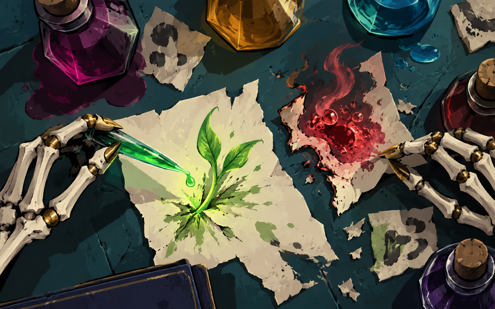

# 图书管理员 · Librarian

**必须同时订阅并启用 BaseLib 与 RitsuLib。** 工坊会列出两个前置，但仍需在游戏中启用它们；手动安装也必须同时安装、启用与游戏分支匹配的两个前置。

**Subscribe to and enable both BaseLib and RitsuLib.** Workshop lists both dependencies; enable them in the game as well. Manual installation also requires both, with versions matching your game branch.

  

浮空藏书馆 · 三元素法球 · Slay the Spire 2 原创角色

本分支维护游戏 **public-beta 0.111.0** 的 **V1.1.0-beta4**。手牌与抽牌堆仅保留金字，移除9张相关卡牌和2项状态的额外悬浮解释；临摹抄本“抽牌堆底”及卡牌文字、效果与数值保持。游戏 stable 0.107.1 的正式 **V1.1.0** 请使用 [main](https://github.com/albertoBradish/Librarian-StS2/tree/main) 与 [v1.1.0-stable](https://github.com/albertoBradish/Librarian-StS2/releases/tag/v1.1.0-stable)，不要混用两个通道的运行文件。

This branch maintains **V1.1.0-beta4 for public-beta 0.111.0**. Hand and Draw Pile keep their gold highlighting without extra hover explanations across all 9 related cards and 2 Powers. Transcribe still specifies the bottom of the Draw Pile; card text, gameplay and values are unchanged. Use `main` and the `v1.1.0-stable` release for stable 0.107.1.

An original playable character mod for **Slay the Spire 2**: a floating magical
archive with three elemental orbs, 91 active cards, 9 relics and 3 potions.
Includes Simplified Chinese and English, independent language settings, and
custom translation packs.

图书管理员通过烈焰、潮涌、翠叶三种法球的注魔、结算与锁定组织战斗。
本仓库用于源码维护、独立版本下载和玩家反馈。

- [Releases / 独立下载](https://github.com/albertoBradish/Librarian-StS2/releases)
- [Latest GitHub pre-release / 最近的 GitHub 测试发行 1.1.0-beta1](https://github.com/albertoBradish/Librarian-StS2/releases/tag/v1.1.0-beta1)。V1.1.0-beta3 已发布至 [beta Steam 工坊](https://steamcommunity.com/sharedfiles/filedetails/?id=3801958367)，中英文页面与 public-beta 分支快照已核验。V1.1.0-beta4 已完成本地验证并同步源码，工坊尚未更新 beta4；最近的 GitHub 独立发行附件仍为 beta1。
- [Historical release index / 历史版本与校验来源](release-history.json)
- [Migration verification / 22 个版本、352 个附件下载核验](release-history/verification.json)
- [Issues / 问题与建议](https://github.com/albertoBradish/Librarian-StS2/issues)
- [Steam Workshop](https://steamcommunity.com/sharedfiles/filedetails/?id=3801958367)
- [Build / 构建](BUILDING.md) · [Release / 发版](RELEASING.md) · [Contributing](CONTRIBUTING.md)
- [Translation packs / 翻译包](TRANSLATIONS.md)

## A story in seven chapters / 七章原创时间线

七章中英故事随现有解锁进度逐步展开，搭配七张章节插图、原生多色文字强调与少量文字动效。从旧藏书馆中的沉睡，到独自整理散卷、研究药剂，浮空书体用自己的方式记录旅程。故事属于模组原创补叙；阅读章节不增加新的解锁要求。

Seven original chapters in Simplified Chinese and English unfold through the existing unlock progression. Seven illustrations, native colored emphasis and restrained text animation accompany a floating book's journey through scattered records and practical experiments. This is original mod fiction, with no additional chapter-unlock requirements.

### Three elements, scattered scrolls / 三元素与散落书卷

烈焰、潮涌、翠叶通过注魔、结算与锁定相互配合。锁定显示可选默认的红色负数回合、旧回合显示，或球心原值加下方回合；显示方式不改变法球规则。

Channel, evoke and lock Fire, Tide and Growth orbs. Choose red negative lock turns, the old turn counter, or the original value with turns below. These display choices leave orb rules unchanged.

### Notes, experiments and choices / 笔记、实验与选择

药剂笔记以手与器物讲述故事。显示、声音和语言设置可从主页右上角的 RitsuLib 页面进入；恢复默认设置保留解锁与游玩进度。开始提示的“确定”仅关闭本次，选择“不再显示”才停止当前版本的自动提示。

Potion notes tell their story through hands and objects. Open Librarian's display, audio and language settings from RitsuLib at the top right of the main menu. Restoring defaults preserves unlock and play progress. “OK” closes the current introduction; “Don't show again” disables automatic introductions for that version.

## Compatibility / 兼容范围

Current source baseline: **1.1.0-beta4**, for the game's public-beta branch.
See [release metadata](release-metadata.json).

| Component | Verified baseline |
| --- | --- |
| Slay the Spire 2 | **0.111.0 public-beta**, BuildID 24724944, commit 41cef1ea |
| [BaseLib](https://github.com/Alchyr/BaseLib-StS2/releases/tag/v3.4.5) | 3.4.5 |
| [RitsuLib](https://github.com/BAKAOLC/STS2-RitsuLib/releases/tag/v0.6.2) | 0.6.2, complete bundle for game API 0.111.0 |

Manifest minimum versions are not a promise of compatibility with newer game
or dependency versions. Single-player is the primary supported path. Multiplayer
integration exists, but real multi-client/reconnect testing and long-term balance
validation remain incomplete. Visual/audio feedback is welcome.

## Install / 安装

1. Use the game branch/version required by the chosen release.
2. Install and enable **both BaseLib and the complete RitsuLib bundle** from their official releases;
   they are separate dependencies and are not bundled here. For Workshop installation, subscribe to and enable both.
3. Download `Librarian.dll`, `Librarian.json`, and `Librarian.pck` from the **same**
   GitHub release and place them in `mods/Librarian/` under your game installation.
   Keep the accompanying licenses/notices and verify `SHA256SUMS.txt` if provided.
4. Avoid loading both Workshop and manual copies of Librarian. Exit the game
   before changing mod files, back up saves, and use a spare profile/new run when
   testing a beta. Follow the game's mod activation/restart prompts.

The automatically generated GitHub **Source code** archives are source snapshots,
not installable mod packages. Download the three named runtime attachments.
Historical binary archive tags contain provenance/notices only when a matching
complete historical source tree is unavailable; they do not substitute current
source for old versions. See the per-version release notes and provenance.
Players do not need the .NET SDK or Godot editor. Workshop and GitHub are separate
distribution channels; each release states its own version and compatibility.

请勿混用不同版本的 DLL/JSON/PCK，也不要同时加载工坊与手动安装的重复副本。
卸载前退出游戏；含本角色内容的存档需要对应模组才能继续。

## Feedback / 反馈

Use an [issue template](https://github.com/albertoBradish/Librarian-StS2/issues/new/choose)
and include game branch/build, mod and dependency versions, installation channel,
other mods, reproduction steps, expected/actual behavior, and screenshots/logs
where useful. Review logs for account names, save data and tokens before posting.

## License / 许可证

**Source-available, not open source.** Project-owned code, setting, writing and
artwork follow the [Librarian Personal Use and Original Content License](LICENSE).
Personal study/builds are permitted; unauthorized adaptation, redistribution,
commercial use and secondary monetization are prohibited. See [original asset
scope](ASSET-LICENSE.md). Upstream MIT portions retain their own permissions:
[notices](THIRD-PARTY-NOTICES.md), [license review](LICENSE-AUDIT.md).

源码公开可读，不代表开源或可自由二创。原创设定、美术、文案等未经书面许可不得
改编、再发布、商用或二次盈利。所有许可首先服从 Mega Crit 的模组政策，作者的
授权不能豁免官方禁止的盈利行为。
This is an unofficial community mod, not affiliated with or endorsed by Mega Crit.

开发与美术制作使用了 AI 辅助，内容由作者审阅并根据玩家反馈调整。
AI tools assisted programming and artwork production. The author reviews the content and revises it with player feedback.
